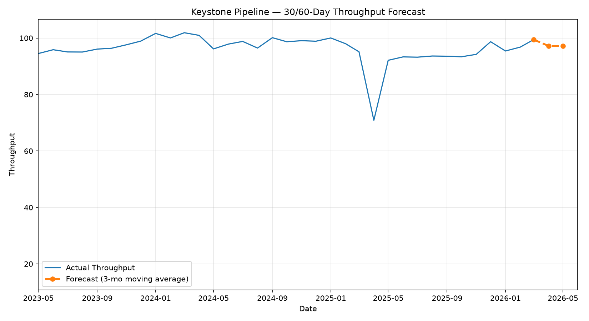

# Pipeline Demand Forecast — 30/60-Day Projection



A short, transparent demand forecasting exercise using real Keystone Pipeline throughput data from the [Canada Energy Regulator (CER)](https://www.cer-rec.gc.ca/), built as hands-on preparation for demand forecasting and commercial analytics work in the energy sector.

## What this does

- Loads the cleaned monthly throughput dataset produced by the companion [pipeline-throughput-analysis](https://github.com/mo-yusuf-da/pipeline-throughput-analysis) project
- Projects the next two months (approx. 30/60 days) of throughput using a **3-month trailing moving average**
- Quantifies recent volatility (mean, standard deviation, range) so the forecast is presented alongside honest uncertainty, not as a false-precision single number
- Outputs a chart, a combined actuals+forecast CSV, and a written narrative documenting method, assumptions, and limitations

## Why a moving average, and not something more advanced

This was a deliberate choice. A moving average is simple enough that I can fully explain every number it produces — no hidden model behavior, no unexplainable output. For a first hands-on forecasting exercise, a method I can defend completely is more valuable than a more sophisticated one I'd have to hand-wave through in an interview.

The tradeoff is real and disclosed in the output narrative: this method assumes the near-term future resembles the recent past, and will **not** anticipate the kind of sharp, short-term disruptions (maintenance windows, apportionment events) that show up repeatedly in the underlying historical data. The forecast narrative explicitly states this limitation and recommends treating the single-point forecast as the center of a wider range — roughly ±1 standard deviation — rather than a precise prediction.

## Result

Using data through March 2026, the model forecasts throughput of **97.21** for both April and May 2026, based on a trailing 3-month average. Trailing 12-month actuals show a mean of 92.88 with a standard deviation of 7.31, ranging from 70.86 to 99.44 — that range, not the single forecast number, is the more honest way to describe near-term expectations given the system's known volatility.

## How to run it

```bash
pip install pandas matplotlib
python forecast.py
```

The script looks for the cleaned dataset at `../pipeline-throughput-analysis/output/keystone_clean.csv` by default, or falls back to a local `keystone_clean.csv` in this folder if present.

## Files

- `forecast.py` — forecast script
- `output/forecast.csv` — combined actuals + forecast
- `output/forecast_chart.png` — visual forecast (shown above)
- `output/forecast_narrative.txt` — method, assumptions, and variance context

## Data source

Canada Energy Regulator, Pipeline Throughput and Capacity Data (Keystone Pipeline), published under the Open Government Licence – Canada.
